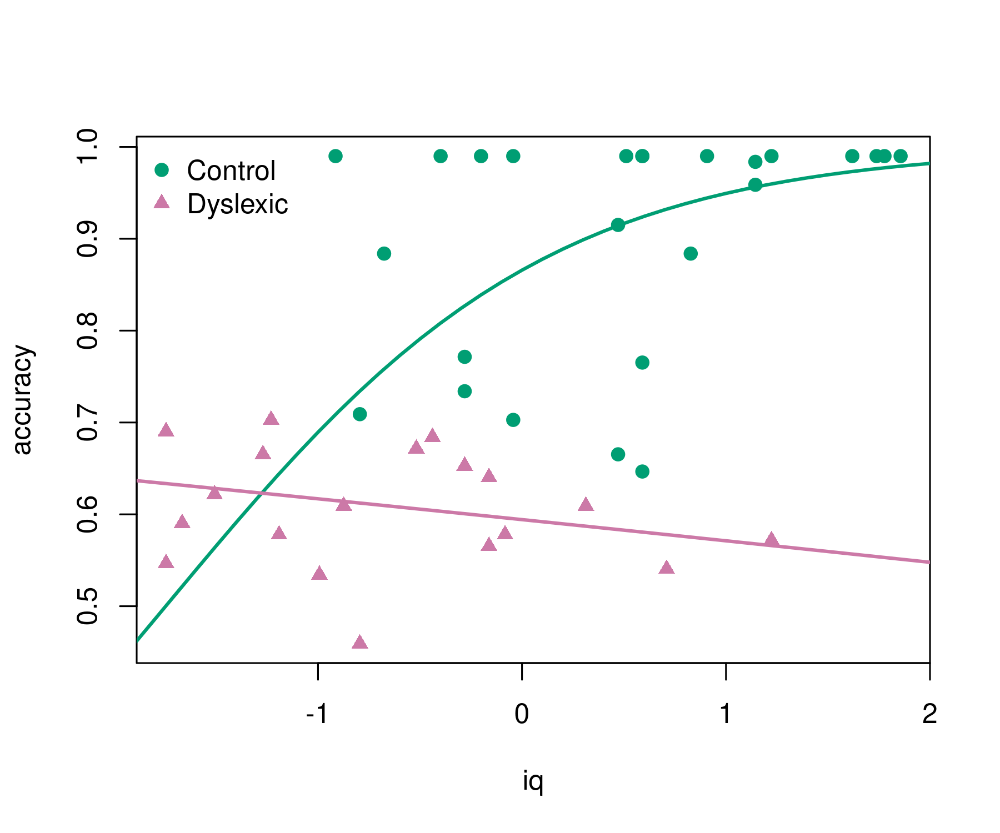

<!-- README.md is generated from README.qmd via: quarto render README.qmd --to gfm -->

# betareg: Beta Regression in R

## Overview

-   Beta regression for modeling beta-distributed dependent variables on
    the open unit interval (0, 1), e.g., rates and proportions, see
    Cribari-Neto and Zeileis (2010,
    [doi:10.18637/jss.v034.i02](https://doi.org/10.18637/jss.v034.i02)).

-   Extended-support beta regression models for variables on the closed
    unit interval \[0, 1\] with boundary observations at 0 and/or 1 see
    Kosmidis and Zeileis (2024, forthcoming).

-   Alternative specifications of the classical beta regression model:
    Bias-corrected and bias-reduced estimation, finite mixture models,
    and recursive partitioning for (0, 1) beta regression, see Grün,
    Kosmidis, and Zeileis (2012,
    [doi:10.18637/jss.v048.i11](https://doi.org/10.18637/jss.v048.i11)).

## Installation

The stable version of `betareg` is available on CRAN:

``` r
install.packages("betareg")
```

The latest development version can be installed from R-universe:

``` r
install.packages("betareg", repos = "https://zeileis.R-universe.dev")
```

## Illustration

A nice first illustration of beta regression is the analysis of reading
accuracy scores from primary school children from Smithson & Verkuilen
(2006). Package and data can be loaded via:

``` r
library("betareg")
data("ReadingSkills", package = "betareg")
```

The reading `accuracy` was scaled to be within (0, 1). Its mean is
explained by verbal `iq` score with separate lines by `dyslexia`
(control vs. dyslexic). The precision parameter is explained by main
effects of the two explanatory variables. More details are provided in
`?ReadingSkills`.

``` r
br <- betareg(accuracy ~ dyslexia * iq | dyslexia + iq, data = ReadingSkills)
summary(br)
#> 
#> Call:
#> betareg(formula = accuracy ~ dyslexia * iq | dyslexia + iq, data = ReadingSkills)
#> 
#> Quantile residuals:
#>     Min      1Q  Median      3Q     Max 
#> -2.3625 -0.5872  0.3026  0.9425  1.5874 
#> 
#> Coefficients (mean model with logit link):
#>             Estimate Std. Error z value Pr(>|z|)    
#> (Intercept)   1.1232     0.1428   7.864 3.73e-15 ***
#> dyslexia     -0.7416     0.1428  -5.195 2.04e-07 ***
#> iq            0.4864     0.1331   3.653 0.000259 ***
#> dyslexia:iq  -0.5813     0.1327  -4.381 1.18e-05 ***
#> 
#> Phi coefficients (precision model with log link):
#>             Estimate Std. Error z value Pr(>|z|)    
#> (Intercept)   3.3044     0.2227  14.835  < 2e-16 ***
#> dyslexia      1.7466     0.2623   6.658 2.77e-11 ***
#> iq            1.2291     0.2672   4.600 4.23e-06 ***
#> ---
#> Signif. codes:  0 '***' 0.001 '**' 0.01 '*' 0.05 '.' 0.1 ' ' 1 
#> 
#> Type of estimator: ML (maximum likelihood)
#> Log-likelihood:  65.9 on 7 Df
#> Pseudo R-squared: 0.5756
#> Number of iterations: 25 (BFGS) + 1 (Fisher scoring)
```

The regression summary shows that `accuracy` increases with `iq` for the
control group but not for the dyslexic group (even slightly decreases).
This can be brought out more clearly graphically. This also highlights
that the model employs a logit link so that the fitted curves always
remain within (0, 1).

``` r
pal <- palette.colors()[c(4, 8)]
pch <- c(19, 17)
plot(accuracy ~ iq, data = ReadingSkills, col = pal[dyslexia], pch = pch[dyslexia])
iq <- -30:30/10
lines(iq, predict(br, newdata = data.frame(dyslexia = "no", iq = iq)), col = pal[1], lwd = 2)
lines(iq, predict(br, newdata = data.frame(dyslexia = "yes", iq = iq)), col = pal[2], lwd = 2)
legend("topleft", c("Control", "Dyslexic"), pch = pch, col = pal, bty = "n")
```



## Extended models

For going beyond this basic analysis the following extensions can be
considered.

### Bias reduction

Bias-reduced estimation (instead of the default maximum likelihood
estimation) can be used by adding the argument `type = "BR"` in
`betareg()`. This slightly shrinks all coefficient estimates but leads
to qualitatively identical results.

``` r
betareg(accuracy ~ dyslexia * iq | dyslexia + iq, data = ReadingSkills, type = "BR")
```

### Extended-support beta regression

To analyze the original accuracy scores in \[0, 1\] (without scaling the
perfect scores of `1` to `0.99`) use the variable `accuracy1` in the
code above. The `betareg()` model then estimates an additional
exceedence parameter that accounts for the boundary probability of a
perfect score.

``` r
betareg(accuracy1 ~ dyslexia * iq | dyslexia + iq, data = ReadingSkills)
```

### Beta regression trees

To find subgroups in a beta regression by recursively splitting
subsamples (rather than fixing the dyslexia interaction in advance),
beta regression trees can be used:

``` r
betatree(accuracy ~ iq | iq, ~ dyslexia + ..., data = ReadingSkills, minsize = 10)
```

See the documentation of `betatree()` for more details.

### Finite mixtures of beta regressions

To find clusters in a beta regression (without even having the dyslexia
information), finite mixtures of beta regressions can be used:

``` r
betamix(accuracy ~ iq, data = ReadingSkills, k = 3, ...)
```

See the documentation of `betamix()` for more details.
